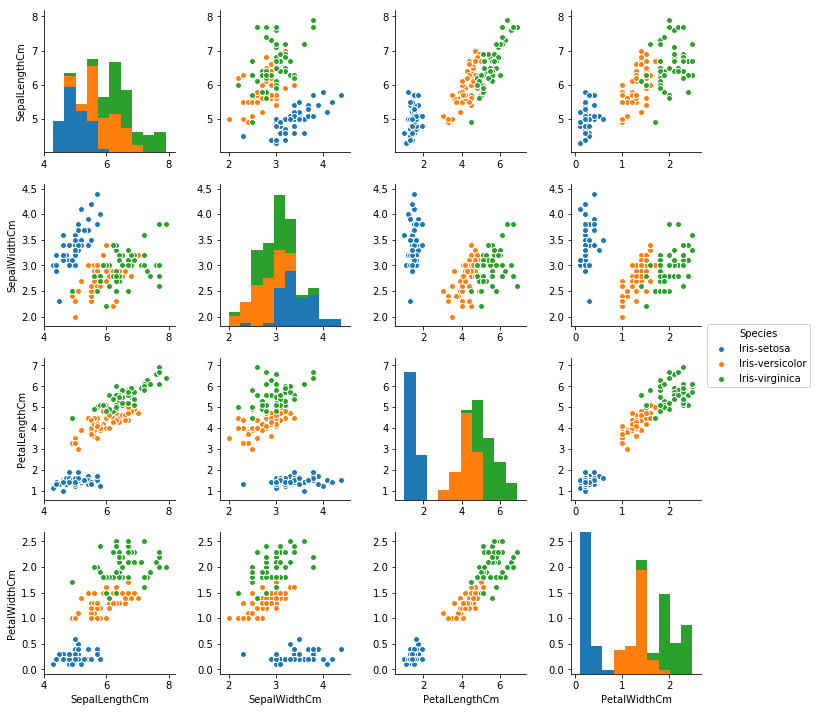

# Welcome to our [team project website!](https://andrewschac.github.io/stash-ka/)

This is a website to showcase our final project for FIN 377 - Data Science for Finance course at Lehigh University.

To see the complete analysis file(s) click [here](https://github.com/andrewschac/stash-ka/blob/main/notebooks/example.ipynb).

## Table of contents
1. [Introduction](#introduction)
2. [Methodology](#meth)
3. [Section 2](#section2)
    1. [Subsection](#subsec2-1)
    2. [Subsection](#subsec2-2)
4. [Analysis Section](#section3)
5. [Summary](#summary)

## Introduction  <a name="introduction"></a>

(The "Introduction" text above is formatted in heading 2 style.) The main goal of this project is to explore *(insert project idea here)*.  

## Methodology <a name="meth"></a>

Here is some code that we used to develop our analysis. Blah Blah. [More details are provided in the Appendix](page2).
 
Note that for the purposes of the website, you have to copy this code into the markdown file and  
put the code inside trip backticks with the keyword `python`.

```python
import seaborn as sns 
iris = sns.load_dataset('iris') 

print(iris.head(),  '\n---')
print(iris.tail(),  '\n---')
print(iris.columns, '\n---')
print("The shape is: ",iris.shape, '\n---')
print("Info:",iris.info(), '\n---') # memory usage, name, dtype, and # of non-null obs (--> # of missing obs) per variable
print(iris.describe(), '\n---') # summary stats, and you can customize the list!
print(iris['species'].value_counts()[:10], '\n---')
print(iris['species'].nunique(), '\n---')
```

Notice that the output does NOT show! **You have to copy in figures and tables from the notebooks.**

## Section <a name="section2"></a>
Blah blah

### Subsection 1 <a name="subsec2-1"></a>
This is a subsection, formatted in heading 3 style

### Subsection 2 <a name="subsec2-2"></a>
This is a subsection, formatted in heading 3 style

## Analysis Section <a name="section3"></a>

Here are some graphs that we created in our analysis. We saved them to the `pics/` subfolder and include them via the usual markdown syntax for pictures.


<br><br>
Some analysis here
<br><br>

<br><br>
More analysis here.
<br><br>

<br><br>
More analysis.

## Summary <a name="summary"></a>

### Research Question

The inspiration for our final project stems from the wide-ranging work from home (WFH) work done by Nicholas Bloom. We plan to utilize some of the data that he has compiled in his work and apply it to understand how the recent WFH shift has influenced employees' experience in the workplace. Generally, we are asking the following questions:
1. Does WFH contribute to a worse experience for employees in regard to training, development, and integration?
2. What is WFH's effect on employee performance?

We plan to approach these questions by assessing the employees on a macro scale. By this, we mean looking at general trends across time and comparing levels of training/development sentiment and performance to the proportion of WFH employees. Some of the specific questions we are going to answer to assess the impact of WFH on employees include:
1. Is an employee more likely to leave a company if they WFH?
2. Does WFH increase employee productivity?
3. How is WFH correlated with employee promotion opportunities? 

In answering these questions, we mostly intend to assess how the levels of variables like productivity are different in times before and after the WFH boom (COVID-19 era). For other variables, like employee retention or promotion opportunities, we plan to compare the correlation of them to the proportion of WFH over time. Our project is wholly meant to explore the relationship between WFH and different variables that quantify employee opportunity and performance. Both of us having experience as students who were forced to learn from home and having WFH work experience in the past, we generally expect the influence of WFH to have a positive impact in most aspects of an employee's experience. Our general hypotheses and corresponding thoughts are outlined below:
- WFH makes an employee more likely to stay with a company
    - *Working from home adds more flexibility to an individual's schedule and reduces unnecessary aspects associated with working (commutes, less time wasted in meetings, monetary savings in regard to food/commute, etc.).*
- WFH increases employee productivity
    - *Employees are more distracted in the workplace and they avoid the downtime that occurs within an office setting.* 
- WFH hinders employees opportunities for growth
    - *With less in-office, face-to-face interaction with superiors, there are less opportunities for employees to be recognized by those who offer promotions and there is less collaboration with other employees.*


## About the team


<br>
Andrew is a senior at Lehigh studying finance.
<br><br><br>

<br>
Jon is a junior at Lehigh studying finance.


## More 

To view the GitHub repo for this website, click [here](https://github.com/andrewschac/stash-ka).
