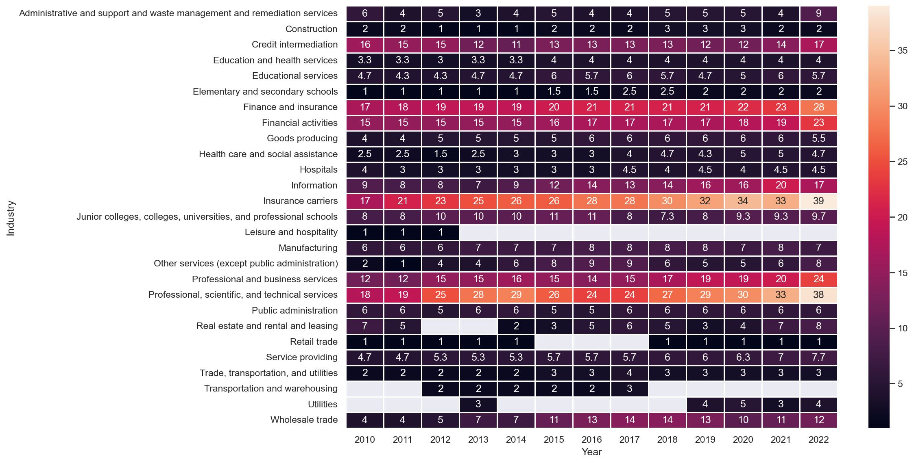

# Work From Home's Influence on Employee Performance and Compensation

## Jon Trzaska and Andrew Schachter

[This](https://andrewschac.github.io/stash-ka/) is a website to showcase our final project for FIN 377 - Data Science for Finance course at Lehigh University.

To see the complete analysis file(s) click [here](https://github.com/andrewschac/stash-ka/blob/main/build_sample.ipynb).

## Table of contents
1. [Introduction](#introduction)
2. [Methodology](#method)
3. [Analysis](#analysis)
4. [Summary](#summary)
5. [About the team](#about)

## Introduction  <a name="introduction"></a>

### Research Question

The inspiration for our final project stems from the wide-ranging work from home (WFH) work done by Nicholas Bloom. We utilized some of the data that he  compiled in his work and applied it to understand how the recent WFH shift has influenced employees' experience in the workplace. Generally, we asked the following questions:

1. Does WFH contribute to a worse experience for employees in regards to turnover and compensation?
2. What is WFH's effect on employee performance?

### Approach

We approached these questions by assessing employees on a macro scale. We wanted to look at general trends across time and compared compensation and performance to the proportion of WFH employees. Some of the specific questions we answered to assess the impact of WFH on employees include:
1. Is an employee more likely to leave a company if they WFH?
2. Does WFH increase employee productivity?
3. How is WFH correlated with employee compensation?

In answering these questions, we compared the correlation of our variables to the proportion of WFH over time. 

### Why this project

The main goal of this project is to explore the relationship between WFH and different variables that quantify employee opportunity and performance. Both of us having experience as students who were forced to learn from home and also having had WFH work experience in the past, we generally expected the influence of WFH to have a positive impact in quality of an employee's experience, yet negative impact on some of the factors we assessed. 

### Hypotheses

Our general hypotheses and corresponding thoughts are outlined below:
- WFH makes an employee more likely to stay with a company
    - *Working from home adds more flexibility to an individual's schedule and reduces unnecessary aspects associated with working (commutes, less time wasted in meetings, monetary savings in regard to food/commute, etc.).*
- WFH increases employee productivity
    - *Employees are more distracted in the workplace and they avoid the downtime that occurs within an office setting.* 
- WFH lessens increases in employee compensation year-over-year
    - *Working from home is a benefit that many employees do not receive. While that changed during the COVID-19 era, being able to work from home is still a luxury that employees would have to pay for out of their own pockets.*   

## Methodology <a name="method"></a>

Here is some code that we used to develop our analysis. Blah Blah. [More details are provided in the Analysis File](https://github.com/andrewschac/stash-ka/blob/main/build_sample.ipynb).
 
Note that for the purposes of the website, you have to copy this code into the markdown file and  
put the code inside trip backticks with the keyword `python`.

```python
import seaborn as sns 
iris = sns.load_dataset('iris') 

print(iris.head(),  '\n---')
print(iris.tail(),  '\n---')
print(iris.columns, '\n---')
print("The shape is: ",iris.shape, '\n---')
print("Info:",iris.info(), '\n---') # memory usage, name, dtype, and # of non-null obs (--> # of missing obs) per variable
print(iris.describe(), '\n---') # summary stats, and you can customize the list!
print(iris['species'].value_counts()[:10], '\n---')
print(iris['species'].nunique(), '\n---')
```

Notice that the output does NOT show! **You have to copy in figures and tables from the notebooks.**

## Analysis <a name="analysis"></a>

Here are some graphs that we created in our analysis. We saved them to the `pics/` subfolder and include them via the usual markdown syntax for pictures.


<br><br>
The heatmap above provides an overview of WFH percentage by industry and year. The x-axis shows year and the y-axis shows each industry, with the shading of the map being percentage of WFH employees. We can see that over time certain industries become more conducive to the WFH environment, while other industries do not change much at all. The specific industries that fall into each category are easily explained by diving into the data. For example, 1% of people working in retail sales were remote because it is impossible to sell things in a store from outside the store. On the other hand, people working for insurance carriers were increasingly given the opportunity to work remotely because the nature of their jobs allowed them to.
<br><br>

<br><br>
The multiple time series graph above shows each industry highlighted in blue and its relation to the rest of the graphs in the background. The x-axis is year and the y-axis is WFH percentage so we can see WFH percentage over time by industry in a different way than the heatmap. Similarly to the heatmap, this series of graphs shows that certain industries provide more opportunities for WFH than others, and WFH generally tends to increase over time.
<br><br>

<br><br>
More analysis.
<br><br>

<br><br>
More analysis.
<br><br>

<br><br>
More analysis.

## Summary <a name="summary"></a>


## About the team <a name="about"></a>


<br>
Andrew is a senior at Lehigh studying finance.
<br><br><br>

<br>
Jon is a junior at Lehigh studying finance.


## More 

To view the GitHub repo for this website, click [here](https://github.com/andrewschac/stash-ka).
