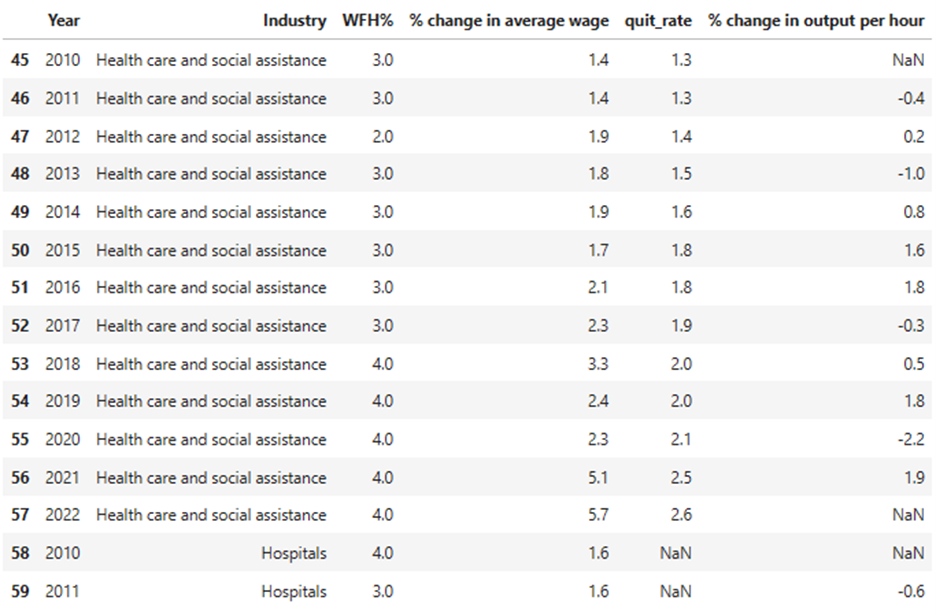

# Work From Home's Influence on Employee Performance and Compensation

[This](https://andrewschac.github.io/stash-ka/) is a website to showcase our final project for FIN 377 - Data Science for Finance course at Lehigh University.

To see the complete analysis file(s) click [here](https://github.com/andrewschac/stash-ka/blob/main/build_sample.ipynb).

## Table of contents
1. [Introduction](#introduction)
2. [Methodology](#method)
3. [Analysis](#analysis)
4. [Summary](#summary)
5. [About the team](#about)

## Introduction  <a name="introduction"></a>

### Research Question

The inspiration for our final project stems from the wide-ranging work from home (WFH) work done by Nicholas Bloom. We utilized some of the data that he  compiled in his work and applied it to understand how the recent WFH shift has influenced employees' experience in the workplace. Generally, we asked the following questions:

1. Does WFH contribute to a worse experience for employees in regards to turnover and compensation?
2. What is WFH's effect on employee performance?

### Approach

We approached these questions by assessing employees on a macro scale. We wanted to look at general trends across time and compared compensation and performance to the proportion of WFH employees. Some of the specific questions we answered to assess the impact of WFH on employees include:
1. Is an employee more likely to leave a company if they WFH?
2. Does WFH increase employee productivity?
3. How is WFH correlated with employee compensation?

In answering these questions, we compared the correlation of our variables to the proportion of WFH over time. 

### Why this project

The main goal of this project is to explore the relationship between WFH and different variables that quantify employee opportunity and performance. Both of us having experience as students who were forced to learn from home and also having had WFH work experience in the past, we generally expected the influence of WFH to have a positive impact in quality of an employee's experience, yet negative impact on some of the factors we assessed. 

### Hypotheses

Our general hypotheses and corresponding thoughts are outlined below:
- WFH makes an employee more likely to stay with a company
    - *Working from home adds more flexibility to an individual's schedule and reduces unnecessary aspects associated with working (commutes, less time wasted in meetings, monetary savings in regard to food/commute, etc.).*
- WFH increases employee productivity
    - *Employees are more distracted in the workplace and they avoid the downtime that occurs within an office setting.* 
- WFH lessens increases in employee compensation year-over-year
    - *Working from home is a benefit that many employees do not receive. While that changed during the COVID-19 era, being able to work from home is still a luxury that employees would have to pay for out of their own pockets.*   

## Methodology <a name="method"></a>

We wanted to create a singular, robust WFH dataset that encompassed the main variables from all of the imported datasets. This dataset contained the following variables:
- Year (across all datasets)
- Industry (across all datasets)
- WFH% (WFH dataset)
- quit_rate (Turnover dataset)
- % change in output per hour (Productivity dataset)
- % change in average wage (Compensation dataset)
This final dataset was in panel format, sorted by industry and year (2010-2022). After constructing the thorough, completed dataset, the variables were transformed into various different types of [visualizations](#analysis). 

### EDA

#### <a id="1">[1]</a> *WFH*
This dataset, obtained from the BLS Employee Benefit Survey, contains the main WFH % variable for our analysis and sets the stage for categorizing each industry. An initial problem that immediately pops up is the data type of the WFH variable as it must be changed to a numeric type to behave correctly in our analysis. Additionally, the excess columns must be dropped in order to simplify the merge. The highest WFH rate is 39% and the lowest is 1%, numbers we believe are quite reasonable.

#### <a id="1">[2]</a> *Turnover*
This dataset, obtained form the BLS JOLTS database, is very straightforward. It contains solely the industry, year, and quit_rate. After describing the variables, the minimum is 0.3% and the maximum is 5.8%. We did not encounter many difficulties when utilizing this dataset. 

#### <a id="1">[3]</a> *Productivity*
This dataset, obtained from the BLS Office of Productivity and Technology, specifically references the "output per hour" variable that they track in their Labor Productivity/Total Factor Productivity databases, however, it is transformed into `% change in output per hour`, annually. This variable is further broken down into industry and year, like the others. There was one issue that we found which may bring up problems; this dataset only spans into 2021, not 2022. This influences the tail end of our visualizations, causing output per hour to trail off before the other variables. All other variables seem sufficient. The % change in output per hour max is 11.3 and the min is -10.9.

#### <a id="1">[4]</a> *Compensation*
This dataset, obtained from the BLS Current Population Survey, provides the compensation variable for our study, `% change in average wage`. When importing the dataset initially, the coumns names are also labeled incorrectly so this needed to be fixed. The % change variable is of sufficient type and its maximum is 8.1% and the minimum is 0%. The standard error column will also need to be deleted.

### Our Coding Process
Our coding process after our EDA was finished can be broken down into three main steps:
1. Readying the datasets for merge
2. Merging the datasets to create our main dataset
3. Using the main dataset to create our graphs

This was the code we used for the merge:

```python
intermediate = pd.merge(WFH, compensation, how='left', on=['Industry','Year'], indicator=True, validate='m:m')
intermediate2 = pd.merge(intermediate, turnover, how='left', on=['Industry','Year'], indicator=True, validate='m:m')
complete_dataset = pd.merge(intermediate2, productivity, how='left', on=['Industry','Year'], indicator=True, validate='m:m')
```

### Final Dataset Example


## Analysis <a name="analysis"></a>

Here are some graphs that we created in our analysis. We saved them to the `pics/` subfolder and include them via the usual markdown syntax for pictures.


<br><br>
The heatmap above provides an overview of WFH percentage by industry and year. The x-axis shows year and the y-axis shows each industry, with the shading of the map being percentage of WFH employees. We can see that over time certain industries become more conducive to the WFH environment, while other industries do not change much at all. The specific industries that fall into each category are easily explained by diving into the data. For example, 1% of people working in retail sales were remote because it is impossible to sell things in a store from outside the store. On the other hand, people working for insurance carriers were increasingly given the opportunity to work remotely because the nature of their jobs allowed them to.
<br><br>

<br><br>
The multiple time series graph above shows each industry highlighted in blue and its relation to the rest of the graphs in the background. The x-axis is year and the y-axis is WFH percentage so we can see WFH percentage over time by industry in a different way than the heatmap. Similarly to the heatmap, this series of graphs shows that certain industries provide more opportunities for WFH than others, and WFH generally tends to increase over time.
<br><br>

<br><br>
The positive correlation suggested in this graph suggests that employees are more likely to leave a company when WFH rate increases. This may partly have to do with time and many employees leaving their jobs during COVID, right when the WFH rate started increasing for many industries.
<br><br>

<br><br>
There is no clear association in this graph. A deeper dive into each industry will have to be done to glean something from this data.
<br><br>

<br><br>
Similarly to the first graph, there is a positive association between employee compensation and WFH rate. However, also like the first graph it is impossible to tell without a deeper dive if this is related to WFH rate increasing over time and employee compensation also increasing over time, or if one causes the other. If we could get change in employee compensation for industries that do not WFH vs. industries that do and compare them on a smaller level, it may be easier to find the answers we are attempting to find. 

## Summary <a name="summary"></a>

### Hypothesis Review

1. WFH makes an employee more likely to stay with a company	
    - We found a positive association between WFH and turnover, suggesting that our hypothesis was wrong in this case
2. WFH increases employee productivity
    - We found no clear association between WFH and productivity and it clearly depended on the industry as to what the correlation was between the two variables
3. WFH lessens increases in employee compensation
    - While there seems to be correlation between the variables, it is difficult to tell if this is related to a time factor or if WFH really is the cause

### Success and Things to Learn From

This project was far from a constant success, we had our fair share of both satisfying success and insurmountable obstacles. What we ultimately realized was that the bulk of the heavy lifting and even the analysis was on the data itself, not the variables in question. Striving to obtain the most representative data for our project was the most difficult part. While initially planning to assess the effect of WFH on employee growth and success, we could not seem to find a way around the various paywalls that protect invaluable consumer attitudes data. Understandably, they know that through their private surveys and studies that they have something that everyone else wants. Not willing to spend money on a dataset, we ultimately had to readjust our project scope to focus on more attainable measures. We relied heavily on the Bureau of Labor Statistics and its accessible data that more accurately describes an employee's condition rather than gaining individual insights. We believe that with the right resources, the project can be transformed into a more robust analysis of US worker attitudes and performance. 

When conducting our analysis we ran into many difficulties when trying to perform regressions. In our early stages, we counted on completing regression to give us more concrete footing when establishing a connection and correlation between WFH and employees. Unfortunately, we found that not all BLS data is created equally and the variance among industry/sector specificity across each variable we collected restricted our ability to conduct regressions. 

## References
<a id="1">[1]</a>
Bureau of Labor Statistics. (2023, May 3). *2010 - 2022 National Compensation Survey: Employee Benefits in the United States* [Data set]. Occupational Employment Statistics. U. S. Department of Labor. [https://www.bls.gov/oes/current/oes_ok.htm#13-0000](https://www.bls.gov/ebs/publications/september-2022-landing-page-employee-benefits-in-the-united-states-march-2022.htm)

<a id="1">[2]</a>
Bureau of Labor Statistics. (2023, May 3). *Job Openings and Labor Turnover Survey* [Data set]. Job Openings and Labor Turnover Survey (JOLTS). U. S. Department of Labor. [https://www.bls.gov/jlt/data.htm](https://www.bls.gov/jlt/data.htm) 

<a id="1">[3]</a>
Bureau of Labor Statistics. (2023, May 3). *Office of Productivity and Technology* [Data set]. Detailed Industry Productivity (Labor, Total Factor, and State Labor). U. S. Department of Labor.[https://www.bls.gov/productivity/data.htm](https://www.bls.gov/productivity/data.htm)

<a id="1">[4]</a>
Bureau of Labor Statistics. (2023, May 3). *Current Employment Statistics - CES (National)* [Data set]. Employment, Hours, and Earnings - National. U. S. Department of Labor.[https://www.bls.gov/ces/data/](https://www.bls.gov/ces/data/)

## About the team <a name="about"></a>


<br>
Andrew is a senior at Lehigh studying finance.
<br><br><br>

<br>
Jon is a junior at Lehigh studying finance.


## More 

To view the GitHub repo for this website, click [here](https://github.com/andrewschac/stash-ka).
